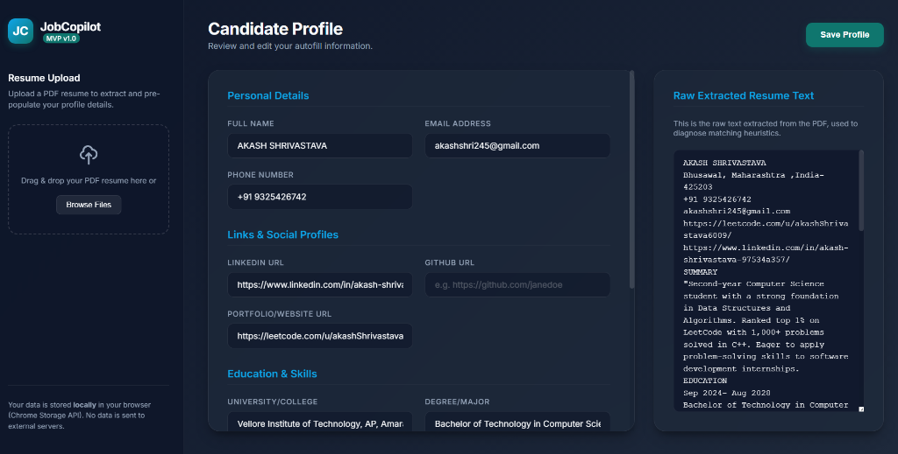
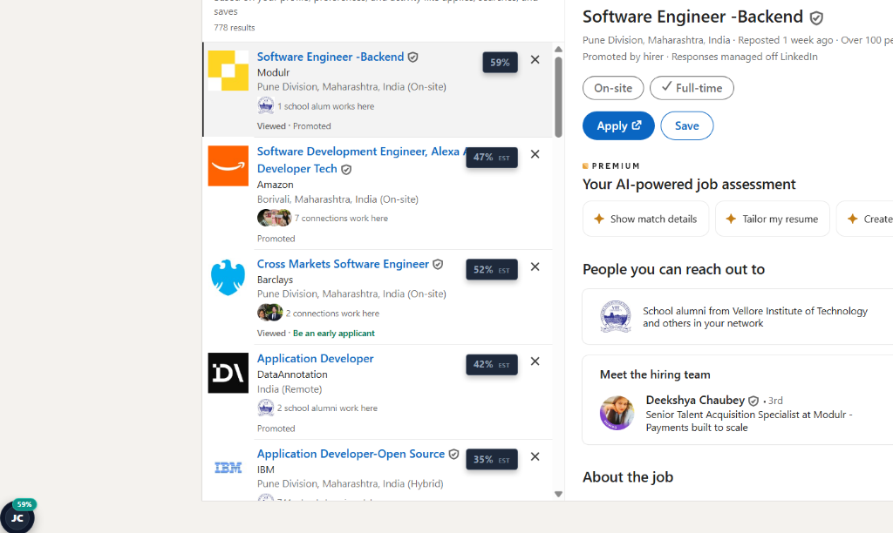
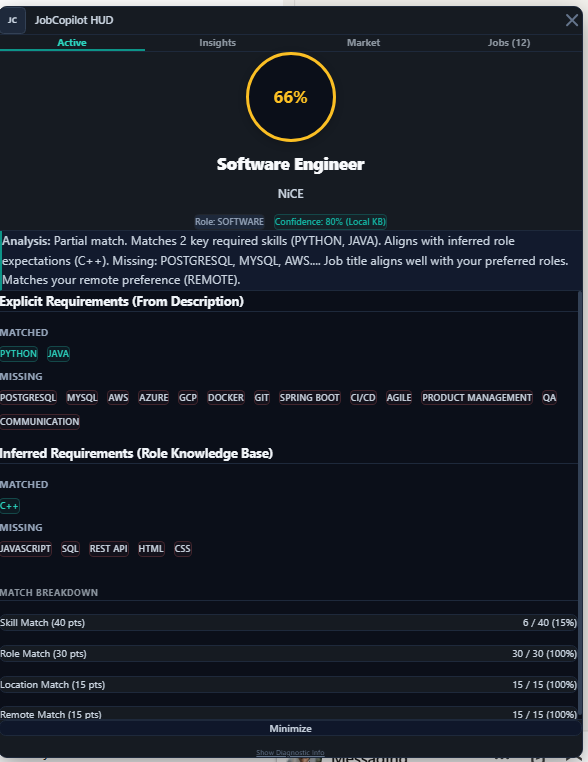
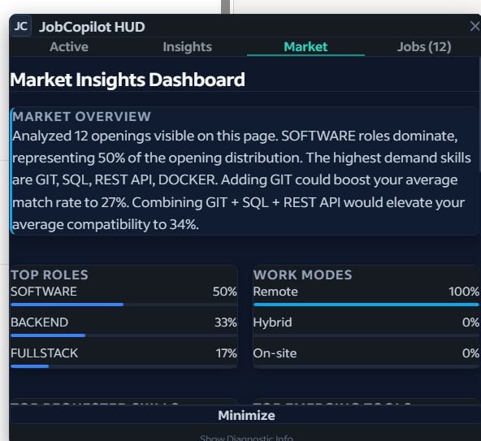

# JobCopilot

<p align="center">
  
</p>

<h3 align="center">Job Discovery, Skill Gap Analysis & Career Intelligence Platform</h3>

<p align="center">
  <strong>Stop opening 50 job postings to find 5 worth applying to.</strong>
</p>

<p align="center">
  <a href="#1-the-problem">The Problem</a> •
  <a href="#2-features--visual-walkthrough">Visual Walkthrough</a> •
  <a href="#3-how-it-works--workflow">Workflow</a> •
  <a href="#4-architecture">Architecture</a> •
  <a href="#5-tech-stack">Tech Stack</a> •
  <a href="#6-installation--development">Installation</a> •
  <a href="#7-roadmap">Roadmap</a>
</p>

---

## 1. The Problem

The modern job application process is broken. Job seekers waste hours opening dozens of browser tabs, reading bloated job descriptions, and manually cross-referencing qualifications against their resumes just to find a handful of roles actually worth applying to. 

Existing helper tools fall short:
*   **Privacy Violations**: Cloud-based extensions send candidates' resumes, contact info, and browsing history to remote servers for parsing and indexing.
*   **Cluttered Interfaces**: Injected light-DOM scripts pollute target websites, inheriting host site styling (like LinkedIn's `62.5%` base font-size) and scaling down widgets to unreadable proportions.
*   **Scoring Without Insights**: Simple matching tools show a generic score (e.g. *"70% Match"*) without explaining the scoring logic or providing concrete skill-building and resume improvement steps.
*   **Commoditized Autofill Focus**: Most products focus strictly on auto-filling forms rather than addressing the core bottleneck: **career intelligence and discovery**.

### The Solution: JobCopilot
JobCopilot is a **privacy-first, client-side browser assistant** that scans, ranks, and analyzes job postings directly inside the browser. By processing all files, text extractions, and matching scores **locally on the client-side** (encapsulated inside an isolated **Shadow DOM** viewport), JobCopilot keeps your data completely secure while giving you immediate, actionable career insights.

---

## 2. Features & Visual Walkthrough

### 1. Resume Upload & Local Profile Parsing
JobCopilot parses your PDF resume entirely inside the browser to extract contact information, education, links, and technical skill sets. Your data is stored locally in chrome storage—never sent to a remote server.
<p align="center">
  
</p>
*   **Local PDF Extraction**: Built on a client-side `pdf.js` parsing worker.
*   **Profile Customization**: Review and edit parsed details, social profiles, and target job preferences (preferred roles, locations, and remote status).

---

### 2. Job Match Scores Injected on LinkedIn & Indeed
Stop click-testing job postings. JobCopilot scans visible list listings on job boards and dynamically injects high-contrast rectangular badges to show estimated compatibility at a glance.
<p align="center">
  
</p>
*   **Estimated Compatibility**: Uses visible card metadata (Job Title, Location, and Work Mode) to compute a baseline compatibility score before you even click a card.
*   **Adaptive Platform Styling**: Badges automatically detect and adjust offsets to clear native controls (like LinkedIn's "X" dismiss button or Indeed's bookmarks).

---

### 3. Active Job Analysis & Detailed Skill Gaps
Clicking a job card triggers a full verified analysis. The HUD's **Active** tab parses the entire description, highlighting exactly why you are a fit and what requirements you are missing.
<p align="center">
  
</p>
*   **Strengths & Gaps Grid**: Displays matched and missing skills side-by-side using high-contrast checks (`✓`) and crossmarks (`✗`).
*   **Impact-Level Gap Breakdown**: Categorizes missing skills into **High Impact** (referenced 3+ times in the description), **Medium Impact** (explicitly requested), and **Optional** (implied industry standards).
*   **Collapsible Deep-Dives**: Collapses secondary details—like implied candidate expectations and exact point-by-point scoring breakdowns—under Notion-like drop-downs.

---

### 4. Real-Time Job Curation & Ranking Dashboard
The HUD's **Jobs** tab ranks every listing detected on the page by compatibility, turning the job board into a curated dashboard.
<p align="center">
  
</p>
*   **Intelligent Sorting**: Sort lists instantly by Match Score, Remote-first alignment, Location Fit, or Post Date.
*   **Interactive Caching**: Clicking a card in the HUD sidebar syncs instantly and programmatically clicks the corresponding card in the page DOM to load details.

---

### 5. Market Curation & Career Intelligence
Instead of answering *"How do I match this single job?"*, the **Market Insights** dashboard answers: *"What does the market want, and what should I learn next?"*
<p align="center">
  
</p>
*   **Skills Demand Histograms**: Displays a ranking of the top 10 requested technical skills and emerging tools across all postings on the page.
*   **Work Mode & Location Distributions**: Visualizes the percentage of Hybrid vs. Remote openings and lists top hiring locations.
*   **Learning Impact Estimator**: Simulates match score gains, demonstrating how acquiring high-demand missing skills updates your average compatibility rate across all visible openings.

---

## 3. How It Works (Workflow)

JobCopilot operates in a local, reactive loop inside the browser:

```
[Candidate Resume PDF] ──► [Local pdf.js Worker] ──► [Chrome Storage (Local Only)]
                                                            │
┌─────────────────────────── Host Page DOM ─────────────────┼──────────────────────────┐
│                                                           ▼                          │
│  [Job Postings List] ──► [Site Adapter] ──► [Estimated Scores] ──► [Injected Badges] │
│                                  │                                                   │
│  [User Clicks Card]  ──► [Description Scrape]                                        │
│                                  │                                                   │
│                                  ▼                                                   │
│                       [Local Match Engine]                                           │
│                       ├── Job Classification                                         │
│                       ├── Weighted Match Scoring                                     │
│                       └── Market Intelligence Caching                                │
│                                  │                                                   │
│                                  ▼                                                   │
│                       [HUD Shadow DOM Viewport] ◄────────────────── [User Interface]  │
└──────────────────────────────────────────────────────────────────────────────────────┘
```

1.  **Ingestion**: The user uploads a resume. The text is parsed locally, and profile preferences (target role, location, remote preference) are written to local extension storage.
2.  **Scraping & Estimation**: As the user browses a job board, a platform-specific **Site Adapter** extracts metadata from visible list cards. JobCopilot immediately injects an **Estimated Score** tag.
3.  **Active Recalculation**: When a card is selected, the adapter scrapes the full job description. The script executes the local **Job Understanding Layer** to extract exact requirements, recalculates a **Verified Score**, and updates the local cache.
4.  **Aggregation**: The **Market Insights Engine** reads the cached results of all cards visible on the page to build real-time histograms, locations count summaries, and learning steps.
5.  **Rendering**: The extension UI builds elements and binds event handlers within an isolated **Shadow DOM** viewport, preventing style contamination.

---

## 4. Architecture Overview

JobCopilot is engineered with a decoupled, event-driven architecture, keeping scraping layers completely separate from evaluation engines and rendering layers.

```
                     ┌──────────────────────────────────────────────┐
                     │                 Host Page DOM                │
                     └────────┬──────────────────────────────┬──────┘
                              │                              ▲
          [Scrapes listings & │                              │ [Injects Match Badges
           active descriptions]                              │  & autofills fields]
                              ▼                              │
   ┌─────────────────────────────────────────────────────────┼──────────────────┐
   │ JobCopilot Context Script (Light DOM)                   │                  │
   │                                                         │                  │
   │ ┌───────────────────────────┐    ┌──────────────────────┴────────────────┐ │
   │ │ Site Adapters             │    │ main: content.js                      │ │
   │ │ (siteAdapters.js)         │    │                                       │ │
   │ │  ├── LinkedIn Scraper     ├───►│  ├── Mounts div#jc-widget-container   │ │
   │ │  ├── Indeed Scraper       │    │  │                                    │ │
   │ │  └── Greenhouse/Lever     │    │  └───────────────────┬────────────────┘ │
   │ └───────────────────────────┘    │                      │                  │
   └──────────────────────────────────┼──────────────────────┼──────────────────┘
                                      │                      │ [Loads HTML & CSS
                                      │ [Invokes engine      │  inside shadow boundary]
                                      │  evaluators]         ▼
   ┌──────────────────────────────────┼──────────┐ ┌────────────────────────────┐
   │ Extension Core Libraries (Local) │          │ │ Shadow DOM (#shadow-root)   │
   │                                  ▼          │ │                            │
   │ ┌─────────────────────────────────────────┐ │ │  ┌──────────────────────┐  │
   │ │ Job Understanding Layer                 │ │ │  │ content.css          │  │
   │ │ (jobUnderstanding.js)                   │ │ │  │ (Resets & PX Layout) │  │
   │ │  ├── Role Classifier                    │ │ │  └──────────┬───────────┘  │
   │ │  └── Pluggable KB / AI providers        │ │ │             ▼              │
   │ └────────────────────┬────────────────────┘ │ │  ┌──────────────────────┐  │
   │                      ▼                      │ │  │ HUD Viewport         │  │
   │ ┌─────────────────────────────────────────┐ │ │  │ (Active/Jobs/Market) │  │
   │ │ Match & Analytics Engine                │ │ │  └──────────────────────┘  │
   │ │ (matchEngine.js)                        │ │ └────────────────────────────┘
   │ │  ├── Weighted Evaluator                 │ │
   │ │  ├── Skill Gap Categorizer              │ │
   │ │  └── Market Insights Aggregator         │ │
   │ └─────────────────────────────────────────┘ │
   └─────────────────────────────────────────────┘
```

### Key Modules & Encapsulation
*   **Site Adapters ([siteAdapters.js](lib/siteAdapters.js))**: Abstract class structure containing selectors for different portals. Custom adapters override logic for LinkedIn ([linkedinAdapter.js](lib/linkedinAdapter.js)) and Indeed.
*   **Job Understanding Layer ([jobUnderstanding.js](lib/jobUnderstanding.js))**: Classifies job titles into 13 software and operations disciplines (Backend, Frontend, Fullstack, DevOps, ML, etc.) and extracts/infers technical requirements using local dictionaries.
*   **Local Match Engine ([matchEngine.js](lib/matchEngine.js))**: Implements a weighted 100-point scoring algorithm:
    $$\text{Score} = \text{Skill Match (40\%)} + \text{Role Alignment (30\%)} + \text{Location Fit (15\%)} + \text{Remote Preference (15\%)}$$
*   **Shadow DOM Isolation ([content.js](content/content.js))**: Appends a `#jc-widget-container` to the host page and attaches an open Shadow DOM root. This guarantees that JobCopilot's UI rules cannot be overwritten by the parent website's stylesheet.
*   **Absolute Sizing Reset ([content.css](content/content.css))**: Relies entirely on absolute pixel (`px`) definitions and starts with `:host { all: initial; }` to strip out inherited parent site scales.

---

## 5. Tech Stack

*   **Runtime Environment**: Google Chrome Extensions (Manifest V3)
*   **Core UI / Logic**: Vanilla Javascript (ES6+), HTML5, CSS3
*   **Encapsulation Boundary**: Shadow DOM (W3C Standard)
*   **PDF Parsing**: local `pdf.js` worker thread
*   **Testing Sandbox**: Offline HTML DOM simulator

---

## 6. Installation & Development

To load the extension locally for development and review:

1.  Clone or download this repository:
    ```bash
    git clone https://github.com/your-username/job-copilot.git
    ```
2.  Open **Google Chrome** and navigate to: `chrome://extensions/`
3.  Enable **Developer mode** using the toggle switch in the top-right corner.
4.  Click **Load unpacked** in the top-left corner.
5.  Select the project root directory (containing `manifest.json`).

### Running the Local Test Sandbox
JobCopilot includes an offline local sandbox that simulates LinkedIn jobs pages.
1.  Open the options page by clicking the extension icon and choosing **Open Profile Dashboard**.
2.  Fill out details (e.g. including skills like `Java`, `SQL`, `React` but leaving out `Docker` and `AWS`) and save.
3.  Open the local simulator file in Chrome:
    ```
    test/test_form.html
    ```
4.  Interact with simulated job cards, check the circular HUD scoring, view market insights demand graphs, and verify the autofill engine.

---

## 7. Roadmap

*   **Deep Offline NLP Indexing**: Replace the heuristic keyword scanner with a lightweight client-side TF-IDF or vector embeddings model (like WebAssembly-powered ONNX Runtime) to parse responsibilities semantically without cloud requests.
*   **Automated Form Fill Training**: Implement a local classification feedback loop where corrected autofill choices train a naive Bayes classifier to map unique form labels to profile attributes over time.
*   **Unified Export**: Support batch-exporting analyzed listings, match scores, and custom phrasing suggestions as JSON/CSV tables for job-hunting tracking.
*   **Additional Portal Adapters**: Build native scrapers for Reed, Glassdoor, and ziprecruiter.
